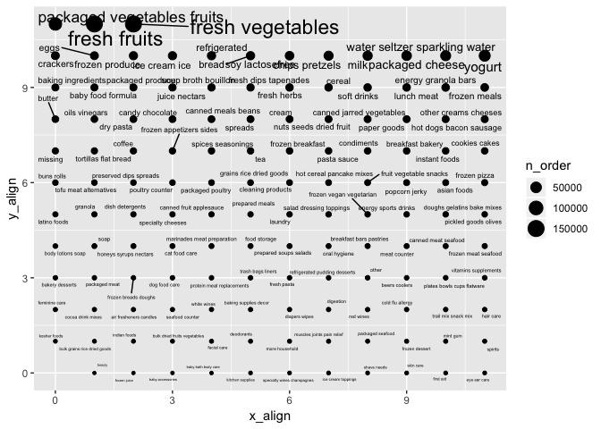

P8105 Homework 3
================
Zanis Fang, UID: ZF2213
10/4/2018

Problem 1
---------

### Data loading

``` r
brfss <- p8105.datasets::brfss_smart2010 %>%
         # overall health topic
         filter(Topic == "Overall Health") %>% 
         # select necessary columns
         select(Year, Locationdesc, Response, Data_value) %>% 
         # seperate location into state and area
         separate(Locationdesc, c("state", "area"), sep = " - ") %>% 
         # recode response into factor variable
         mutate(Response = forcats::fct_relevel(Response,
                                                c("Excellent",
                                                  "Very good",
                                                  "Good",
                                                  "Fair",
                                                  "Poor"))) %>%
         # clean column names
         janitor::clean_names() %>% 
         # arrange dataset according to response from excellent to poor
         arrange(response)
```

*Q1. In 2002, which states were observed at 7 locations?*

``` r
# get year 2002
brfss %>% filter(year == 2002) %>%
          # get unique area
          distinct(state, area) %>%
          # group by states
          group_by(state) %>%
          # number of observations for each state
          summarize(locations = n()) %>%
          # get states which observed at 7 locations
          filter(locations == 7)
```

    ## # A tibble: 3 x 2
    ##   state locations
    ##   <chr>     <int>
    ## 1 CT            7
    ## 2 FL            7
    ## 3 NC            7

Connecticut, Florida, North Carolina are observed at 7 locations.

*Q2. Make a “spaghetti plot” that shows the number of observations in each state from 2002 to 2010.*

``` r
# get distinct locations for each year each state
brfss %>% distinct(year, state, area) %>%
          # group according to year and state
          group_by(year, state) %>% 
          # count the number of observations for each year each state
          summarize(n_obs = n()) %>%
          # plot the spaghetti plot
          ggplot(aes(x = year, y = n_obs, color = state)) +
          geom_line() +
          viridis::scale_color_viridis(
           name = "state",
           discrete = TRUE
          ) +
          theme(legend.position = "none")
```


*Q3. Make a table showing, for the years 2002, 2006, and 2010, the mean and standard deviation of the proportion of “Excellent” responses across locations in NY State.*

``` r
# filter out year 2002, 2006, 2010 in NY state with response "Excellent"
brfss %>% filter(year %in% c(2002, 2006, 2010), response == "Excellent", state == "NY") %>% 
          # group according to area
          group_by(area) %>% 
          # get mean and sd across three years
          summarize(mean = mean(data_value), sd = sd(data_value)) %>% 
          # make a readable table
          knitr::kable()
```

| area               |      mean|         sd|
|:-------------------|---------:|----------:|
| Bronx County       |  17.60000|         NA|
| Erie County        |  17.20000|         NA|
| Kings County       |  20.36667|  1.7672955|
| Monroe County      |  22.40000|         NA|
| Nassau County      |  24.93333|  2.8219379|
| New York County    |  27.50000|  1.5394804|
| Queens County      |  19.63333|  1.3576941|
| Suffolk County     |  24.10000|  3.2787193|
| Westchester County |  26.45000|  0.6363961|

Since in Bronx, Erie and Monroe, there were only one observation out of three years, so sd are NAs.

*Q4. For each year and state, compute the average proportion in each response category (taking the average across locations in a state). Make a five-panel plot that shows, for each response category separately, the distribution of these state-level averages over time.*

``` r
brfss %>% group_by(year, state, response) %>% 
          summarize(mean = mean(data_value)) %>% 
          ggplot(aes(x = year, y = mean, color = state)) + 
            geom_line() +
            facet_grid(. ~ response)
```

    ## Warning: Removed 1 rows containing missing values (geom_path).


Problem 2
---------

### Data loading

``` r
# load data
instacart <- p8105.datasets::instacart
```

This dataset has 1384617 entries. All the entries are the order information from registered customers. Each row describes an item ordered by a customer. For item, there are columns describe the name, department, aisle, and corresponding ID of the item. For order include the information about the customer ID, nth order from the customer, days since last order (frequency of order), time of the order in a week, time of the order in a day.

*Q1. How many aisles are there, and which aisles are the most items ordered from?*

``` r
# list how many distinct aisles
instacart %>% distinct(aisle) %>% nrow()
```

    ## [1] 134

``` r
# 
instacart %>% group_by(aisle) %>% summarize(n_order = n()) %>% arrange(desc(n_order))
```

    ## # A tibble: 134 x 2
    ##    aisle                         n_order
    ##    <chr>                           <int>
    ##  1 fresh vegetables               150609
    ##  2 fresh fruits                   150473
    ##  3 packaged vegetables fruits      78493
    ##  4 yogurt                          55240
    ##  5 packaged cheese                 41699
    ##  6 water seltzer sparkling water   36617
    ##  7 milk                            32644
    ##  8 chips pretzels                  31269
    ##  9 soy lactosefree                 26240
    ## 10 bread                           23635
    ## # ... with 124 more rows

There are 134 aisles. Fresh vegetables and fresh fruits aisles are ordered the most.

*Q2. Make a plot that shows the number of items ordered in each aisle. Order aisles sensibly, and organize your plot so others can read it.*

``` r
instacart %>%
 group_by(aisle) %>%
 summarize(n_order = n()) %>% 
 arrange(n_order) %>% 
 mutate(x_align = row_number() %% 12, y_align = row_number() %/% 12) %>%
 ggplot(aes(x = x_align, y = y_align, size = n_order)) +
   geom_point() +
   ggrepel::geom_text_repel(aes(label = aisle))
```



*Q3. Make a table showing the most popular item aisles “baking ingredients”, “dog food care”, and “packaged vegetables fruits”*

``` r
instacart %>% filter(aisle %in% c("baking ingredients", "dog food care", "packaged vegetables fruits")) %>% group_by(aisle, product_name) %>% summarize(n_order = n()) %>% group_by(aisle) %>% filter(n_order == max(n_order)) %>% knitr::kable()
```

| aisle                      | product\_name                                 |  n\_order|
|:---------------------------|:----------------------------------------------|---------:|
| baking ingredients         | Light Brown Sugar                             |       499|
| dog food care              | Snack Sticks Chicken & Rice Recipe Dog Treats |        30|
| packaged vegetables fruits | Organic Baby Spinach                          |      9784|

*Q4. Make a table showing the mean hour of the day at which Pink Lady Apples and Coffee Ice Cream are ordered on each day of the week; format this table for human readers (i.e. produce a 2 x 7 table).*

``` r
instacart %>% filter(product_name %in% c("Pink Lady Apples", "Coffee Ice Cream")) %>% group_by(product_name, order_dow) %>% summarize(mean_hour = mean(order_hour_of_day)) %>% spread(key = order_dow, value = mean_hour) %>% knitr::kable()
```

| product\_name    |         0|         1|         2|         3|         4|         5|         6|
|:-----------------|---------:|---------:|---------:|---------:|---------:|---------:|---------:|
| Coffee Ice Cream |  13.77419|  14.31579|  15.38095|  15.31818|  15.21739|  12.26316|  13.83333|
| Pink Lady Apples |  13.44118|  11.36000|  11.70213|  14.25000|  11.55172|  12.78431|  11.93750|

Problem 3
---------

### Data loading

``` r
ny_noaa <- p8105.datasets::ny_noaa
```
