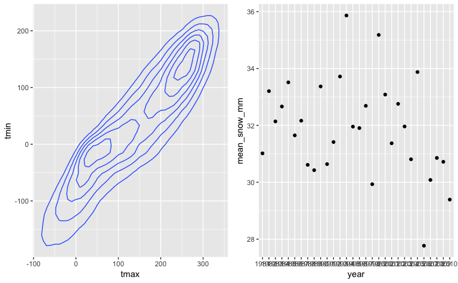
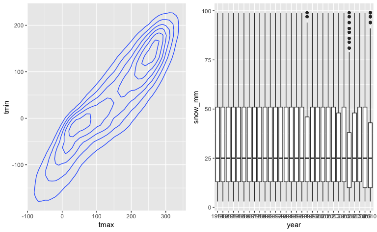

P8105 Homework 3
================
Zanis Fang, UID: ZF2213
10/4/2018

Problem 1
---------

### Data loading

``` r
# loading data
brfss <- p8105.datasets::brfss_smart2010 %>%
         # overall health topic
         filter(Topic == "Overall Health") %>% 
         # select necessary columns
         select(Year, Locationdesc, Response, Data_value) %>% 
         # seperate location into state and area
         separate(Locationdesc, c("state", "area"), sep = " - ") %>% 
         # recode response into factor variable
         mutate(Response = forcats::fct_relevel(Response,
                                                c("Excellent",
                                                  "Very good",
                                                  "Good",
                                                  "Fair",
                                                  "Poor"))) %>%
         # clean column names
         janitor::clean_names() %>% 
         # arrange dataset according to response from excellent to poor
         arrange(response)
```

*Q1. In 2002, which states were observed at 7 locations?*

``` r
# get year 2002
brfss %>% filter(year == 2002) %>%
          # get unique area
          distinct(state, area) %>%
          # group by states
          group_by(state) %>%
          # number of observations for each state
          summarize(locations = n()) %>%
          # get states which observed at 7 locations
          filter(locations == 7) %>%
          # output table
          knitr::kable(caption = "States Observed", longtable = TRUE)
```

<table>
<caption>
States Observed
</caption>
<thead>
<tr>
<th style="text-align:left;">
state
</th>
<th style="text-align:right;">
locations
</th>
</tr>
</thead>
<tbody>
<tr>
<td style="text-align:left;">
CT
</td>
<td style="text-align:right;">
7
</td>
</tr>
<tr>
<td style="text-align:left;">
FL
</td>
<td style="text-align:right;">
7
</td>
</tr>
<tr>
<td style="text-align:left;">
NC
</td>
<td style="text-align:right;">
7
</td>
</tr>
</tbody>
</table>
Connecticut, Florida, North Carolina are observed at 7 locations.

*Q2. Make a “spaghetti plot” that shows the number of observations in each state from 2002 to 2010.*

``` r
# get distinct locations for each year each state
brfss %>% distinct(year, state, area) %>%
          # group according to year and state
          group_by(year, state) %>% 
          # count the number of observations for each year each state
          summarize(n_obs = n()) %>%
          # plot the spaghetti plot
          ggplot(aes(x = year, y = n_obs, color = state)) +
          geom_line() +
          geom_text(aes(label = ifelse(n_obs > 15, state, "")), show.legend = FALSE) +
          labs(
           title = "Unique locations across years for each state",
           x = "Years",
           y = "Number of Locations",
           caption = "Data from the brfss_smart2010"
          ) +
          viridis::scale_color_viridis(
           name = "state",
           discrete = TRUE
          ) +
          scale_x_continuous(breaks = c(2002:2010)) +
          theme(legend.position = "right", plot.title = element_text(hjust = 0.5))
```


Florida sharply increased the number of observations of more than 40 locations in year 2007 and 2010, and remained low during other years. New Jersey was on average the mostly observed state, around 20 observations each year started from 2005.

*Q3. Make a table showing, for the years 2002, 2006, and 2010, the mean and standard deviation of the proportion of “Excellent” responses across locations in NY State.*

``` r
# filter out year 2002, 2006, 2010 in NY state with response "Excellent"
brfss %>% filter(year %in% c(2002, 2006, 2010), response == "Excellent", state == "NY") %>% 
          # group according to area
          group_by(area) %>% 
          # get mean and sd across three years
          summarize(mean = mean(data_value), sd = sd(data_value)) %>% 
          # make a readable table
          knitr::kable(digits = 2, caption = "Excellent proportions")
```

<table>
<caption>
Excellent proportions
</caption>
<thead>
<tr>
<th style="text-align:left;">
area
</th>
<th style="text-align:right;">
mean
</th>
<th style="text-align:right;">
sd
</th>
</tr>
</thead>
<tbody>
<tr>
<td style="text-align:left;">
Bronx County
</td>
<td style="text-align:right;">
17.60
</td>
<td style="text-align:right;">
NA
</td>
</tr>
<tr>
<td style="text-align:left;">
Erie County
</td>
<td style="text-align:right;">
17.20
</td>
<td style="text-align:right;">
NA
</td>
</tr>
<tr>
<td style="text-align:left;">
Kings County
</td>
<td style="text-align:right;">
20.37
</td>
<td style="text-align:right;">
1.77
</td>
</tr>
<tr>
<td style="text-align:left;">
Monroe County
</td>
<td style="text-align:right;">
22.40
</td>
<td style="text-align:right;">
NA
</td>
</tr>
<tr>
<td style="text-align:left;">
Nassau County
</td>
<td style="text-align:right;">
24.93
</td>
<td style="text-align:right;">
2.82
</td>
</tr>
<tr>
<td style="text-align:left;">
New York County
</td>
<td style="text-align:right;">
27.50
</td>
<td style="text-align:right;">
1.54
</td>
</tr>
<tr>
<td style="text-align:left;">
Queens County
</td>
<td style="text-align:right;">
19.63
</td>
<td style="text-align:right;">
1.36
</td>
</tr>
<tr>
<td style="text-align:left;">
Suffolk County
</td>
<td style="text-align:right;">
24.10
</td>
<td style="text-align:right;">
3.28
</td>
</tr>
<tr>
<td style="text-align:left;">
Westchester County
</td>
<td style="text-align:right;">
26.45
</td>
<td style="text-align:right;">
0.64
</td>
</tr>
</tbody>
</table>
Since in Bronx, Erie and Monroe, there were only one observation out of three years, so sd are NAs. On average the New York County has most people responded excellent and least people responded excellent in Erie County.

*Q4. For each year and state, compute the average proportion in each response category (taking the average across locations in a state). Make a five-panel plot that shows, for each response category separately, the distribution of these state-level averages over time.*

``` r
# grouping
brfss %>% group_by(year, state, response) %>% 
          # get mean for each combination
          summarize(mean = mean(data_value)) %>% 
          # plot multiple spaghetti plots
          ggplot(aes(x = year, y = mean, color = state)) + 
            geom_line() +
            # multi panels
            facet_grid(. ~ response) +
            labs(
              title = "Mean for each state, year across locations",
              x = "Years",
              y = "Mean of proportions",
              caption = "Data from the brfss_smart2010"
            ) +
          # make title in the middle
          theme(plot.title = element_text(hjust = 0.5),
                # make x tick 45 angle
                axis.text.x = element_text(angle = 45)
                )
```

    ## Warning: Removed 1 rows containing missing values (geom_path).


The proportions of overall responses from high to low is "very good", "good", "excellent", "fair", "poor". It is worthy noting that he proportions of "excellent" are very slightly decreasing along the years. For each response there are some outliers in some states during some years.

Problem 2
---------

### Data loading

``` r
# load data
instacart <- p8105.datasets::instacart
```

This dataset has 1384617 entries. All the entries are the order information from registered customers. Each row describes an item ordered by a customer. For item, there are columns describe the name, department, aisle, and corresponding ID of the item. For order include the information about the customer ID, nth order from the customer, days since last order (frequency of order), time of the order in a week, time of the order in a day.

*Q1. How many aisles are there, and which aisles are the most items ordered from?*

``` r
# list how many distinct aisles
instacart %>% 
 count(aisle) %>%
 nrow()
```

    ## [1] 134

``` r
# get number of aisles
instacart %>%
 group_by(aisle) %>%
 summarize(n_order = n()) %>%
 arrange(desc(n_order)) %>% 
 top_n(10)
```

    ## Selecting by n_order

    ## # A tibble: 10 x 2
    ##    aisle                         n_order
    ##    <chr>                           <int>
    ##  1 fresh vegetables               150609
    ##  2 fresh fruits                   150473
    ##  3 packaged vegetables fruits      78493
    ##  4 yogurt                          55240
    ##  5 packaged cheese                 41699
    ##  6 water seltzer sparkling water   36617
    ##  7 milk                            32644
    ##  8 chips pretzels                  31269
    ##  9 soy lactosefree                 26240
    ## 10 bread                           23635

There are 134 aisles. Fresh vegetables and fresh fruits aisles are ordered the most.

*Q2. Make a plot that shows the number of items ordered in each aisle. Order aisles sensibly, and organize your plot so others can read it.*

``` r
instacart %>%
 # group by aisle
 group_by(aisle) %>%
 # number of orders for each aisle
 summarize(n_order = n()) %>%
 # sort according to number of orders
 mutate(rank = rank(n_order)) %>% 
 # plot scatterplot
 ggplot(aes(x = reorder(aisle, rank), y = log(n_order))) +
   # plot points
   geom_bar(stat = "identity", aes(color = log(n_order))) +
   coord_flip() +
   # add labels and titles
   labs(
    title = "Number of orders for each aisle (order > 20000 are labelled)",
    x = "Percent rank of aisle order number",
    y = "Log transformed order numbers",
    caption = "Data from the instacart"
    ) +
   # make title in the middle
   theme(plot.title = element_text(hjust = 0.5),
         plot.margin = )
```


Vegetables, fruits, sparkling water, yogurt, cheese, milk, chips, pretzels, bread, soy are ordered most. All of them are food!

*Q3. Make a table showing the most popular item aisles “baking ingredients”, “dog food care”, and “packaged vegetables fruits”*

``` r
instacart %>%
 # get the three aisle
 filter(aisle %in% c("baking ingredients",
                     "dog food care",
                     "packaged vegetables fruits")) %>%
 # group according to aisle and products
 group_by(aisle, product_name) %>%
 # number of orders for each item
 summarize(number_orders = n()) %>%
 # group by aisle
 group_by(aisle) %>%
 # get items with largest order number in each aisle
 filter(number_orders == max(number_orders)) %>%
 # output table
 knitr::kable(caption = "Most Popular Item Aisles",
              digits = 2)
```

<table>
<caption>
Most Popular Item Aisles
</caption>
<thead>
<tr>
<th style="text-align:left;">
aisle
</th>
<th style="text-align:left;">
product\_name
</th>
<th style="text-align:right;">
number\_orders
</th>
</tr>
</thead>
<tbody>
<tr>
<td style="text-align:left;">
baking ingredients
</td>
<td style="text-align:left;">
Light Brown Sugar
</td>
<td style="text-align:right;">
499
</td>
</tr>
<tr>
<td style="text-align:left;">
dog food care
</td>
<td style="text-align:left;">
Snack Sticks Chicken & Rice Recipe Dog Treats
</td>
<td style="text-align:right;">
30
</td>
</tr>
<tr>
<td style="text-align:left;">
packaged vegetables fruits
</td>
<td style="text-align:left;">
Organic Baby Spinach
</td>
<td style="text-align:right;">
9784
</td>
</tr>
</tbody>
</table>
Light brown sugar, snack sticks chicken & rice recipe dog treats, organic baby spinach are most ordered items in the corresponding three aisle. Organic baby spinach greatly outnumbers the other two.

*Q4. Make a table showing the mean hour of the day at which Pink Lady Apples and Coffee Ice Cream are ordered on each day of the week; format this table for human readers (i.e. produce a 2 x 7 table).*

``` r
instacart %>%
 # get the products
 filter(product_name %in% c("Pink Lady Apples", "Coffee Ice Cream")) %>%
 # group by day of week and product name
 group_by(product_name, order_dow) %>%
 # get mean hours for each group
 summarize(mean_hour = mean(order_hour_of_day)) %>%
 # make human readable table
 spread(key = order_dow, value = mean_hour) %>%
 # output table
 knitr::kable(escape = FALSE)
```

<table>
<thead>
<tr>
<th style="text-align:left;">
product\_name
</th>
<th style="text-align:right;">
0
</th>
<th style="text-align:right;">
1
</th>
<th style="text-align:right;">
2
</th>
<th style="text-align:right;">
3
</th>
<th style="text-align:right;">
4
</th>
<th style="text-align:right;">
5
</th>
<th style="text-align:right;">
6
</th>
</tr>
</thead>
<tbody>
<tr>
<td style="text-align:left;">
Coffee Ice Cream
</td>
<td style="text-align:right;">
13.77419
</td>
<td style="text-align:right;">
14.31579
</td>
<td style="text-align:right;">
15.38095
</td>
<td style="text-align:right;">
15.31818
</td>
<td style="text-align:right;">
15.21739
</td>
<td style="text-align:right;">
12.26316
</td>
<td style="text-align:right;">
13.83333
</td>
</tr>
<tr>
<td style="text-align:left;">
Pink Lady Apples
</td>
<td style="text-align:right;">
13.44118
</td>
<td style="text-align:right;">
11.36000
</td>
<td style="text-align:right;">
11.70213
</td>
<td style="text-align:right;">
14.25000
</td>
<td style="text-align:right;">
11.55172
</td>
<td style="text-align:right;">
12.78431
</td>
<td style="text-align:right;">
11.93750
</td>
</tr>
</tbody>
</table>
People buy ice cream late from Monday to Thursday, early during weekends and Friday. People buy apples around 2:00 pm in Wednesday and Sunday, but around noon for the rests.

Problem 3
---------

### Data loading

``` r
ny_noaa <- p8105.datasets::ny_noaa %>%
 separate(col = date, into = c("year", "month", "day"), sep = "-") %>%
 rename(prcp_01mm = prcp, snow_mm = snow, snwd_mm = snwd) %>%
 mutate(tmax = as.integer(tmax), tmin = as.integer(tmin))

ny_noaa %>% count(is.na(snow_mm))
```

    ## # A tibble: 2 x 2
    ##   `is.na(snow_mm)`       n
    ##   <lgl>              <int>
    ## 1 FALSE            2213955
    ## 2 TRUE              381221

``` r
ny_noaa %>% count(is.na(snwd_mm))
```

    ## # A tibble: 2 x 2
    ##   `is.na(snwd_mm)`       n
    ##   <lgl>              <int>
    ## 1 FALSE            2003390
    ## 2 TRUE              591786

``` r
ny_noaa %>% count(is.na(prcp_01mm))
```

    ## # A tibble: 2 x 2
    ##   `is.na(prcp_01mm)`       n
    ##   <lgl>                <int>
    ## 1 FALSE              2449338
    ## 2 TRUE                145838

``` r
ny_noaa %>% count(is.na(tmax))
```

    ## # A tibble: 2 x 2
    ##   `is.na(tmax)`       n
    ##   <lgl>           <int>
    ## 1 FALSE         1460818
    ## 2 TRUE          1134358

``` r
ny_noaa %>% count(is.na(tmin))
```

    ## # A tibble: 2 x 2
    ##   `is.na(tmin)`       n
    ##   <lgl>           <int>
    ## 1 FALSE         1460756
    ## 2 TRUE          1134420

The dataset has 1384617 entries. 747 unique stations. There are 9 variables, station id, date of observation, precipitation (in 0.1 mm), snowfall (in mm), snow depth (in mm), max temperature (0.1 ºC), min temperature (0.1 ºC). Many stations only collect a subset of these data for some time. There are around 2.2 million (85.3%) entries without snowfall observations, 2.0 million (77.2%) entries without snow depth information, 2.5 million (94.4%) entries without precipitation data, 1.46 million (56.3%) without temperature data. .

*Q1. For snowfall, what are the most commonly observed values? Why?*

``` r
ny_noaa %>% 
 filter(!is.na(tmin), !is.na(snow_mm)) %>% 
 mutate(tmin_neg100 = tmin > -100) %>% 
 group_by(tmin_neg100) %>% 
 count(snow_mm == 0)
```

    ## # A tibble: 4 x 3
    ## # Groups:   tmin_neg100 [2]
    ##   tmin_neg100 `snow_mm == 0`       n
    ##   <lgl>       <lgl>            <int>
    ## 1 FALSE       FALSE            50851
    ## 2 FALSE       TRUE             96722
    ## 3 TRUE        FALSE            68706
    ## 4 TRUE        TRUE           1071768

``` r
ny_noaa %>% 
 filter(!is.na(tmin), !is.na(snow_mm)) %>% 
 mutate(tmin_0 = tmin > 0) %>% 
 group_by(tmin_0) %>% 
 count(snow_mm == 0)
```

    ## # A tibble: 4 x 3
    ## # Groups:   tmin_0 [2]
    ##   tmin_0 `snow_mm == 0`      n
    ##   <lgl>  <lgl>           <int>
    ## 1 FALSE  FALSE          117822
    ## 2 FALSE  TRUE           378116
    ## 3 TRUE   FALSE            1735
    ## 4 TRUE   TRUE           790374

``` r
ny_noaa %>% 
 filter(!is.na(tmin), !is.na(snow_mm)) %>% 
 mutate(tmin_100 = tmin > 100) %>% 
 group_by(tmin_100) %>% 
 count(snow_mm == 0)
```

    ## # A tibble: 4 x 3
    ## # Groups:   tmin_100 [2]
    ##   tmin_100 `snow_mm == 0`      n
    ##   <lgl>    <lgl>           <int>
    ## 1 FALSE    FALSE          119537
    ## 2 FALSE    TRUE           794547
    ## 3 TRUE     FALSE              20
    ## 4 TRUE     TRUE           373943

*Q2. Make a two-panel plot showing the average temperature in January and in July in each station across years. Is there any observable / interpretable structure? Any outliers?*

``` r
ny_noaa %>% filter(month %in% c("01", "07")) %>%
 group_by(id, month) %>%
 summarize(mean_temp = mean(tmax, na.rm = TRUE)) %>%
 filter(!is.na(mean_temp)) %>% 
 ggplot(aes(y = mean_temp, x = id)) +
   geom_point() +
   geom_text(aes(label = ifelse(mean_temp < -60, id, "")), vjust = 1) +
   facet_grid(. ~ month)
```



*Q3. Make a two-panel plot showing (i) tmax vs tmin for the full dataset (note that a scatterplot may not be the best option); and (ii) make a plot showing the distribution of snowfall values greater than 0 and less than 100 separately by year.*

``` r
tmax_tmin <- ny_noaa %>% ggplot(aes(x = tmax, y = tmin)) + geom_density_2d()

snf <- ny_noaa %>% filter(snow_mm > 0, snow_mm < 100) %>% 
                   ggplot(aes(x = year, y = snow_mm)) +
                     geom_boxplot()
library(patchwork)
tmax_tmin + snf
```

    ## Warning: Removed 1136276 rows containing non-finite values
    ## (stat_density2d).


