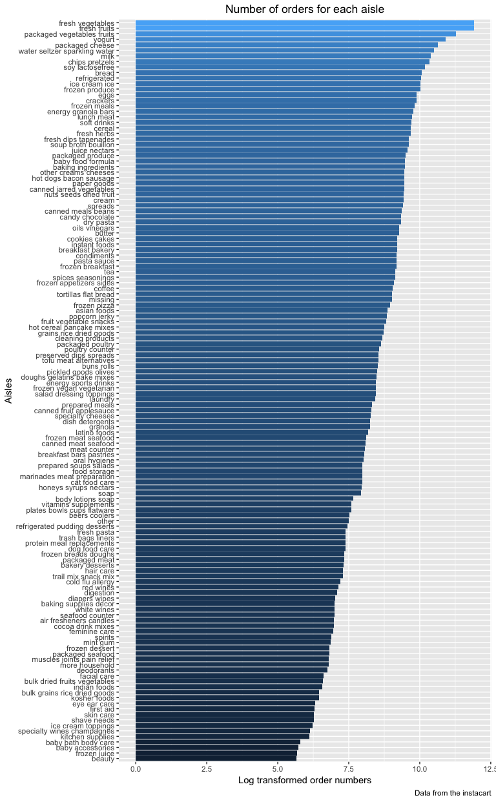
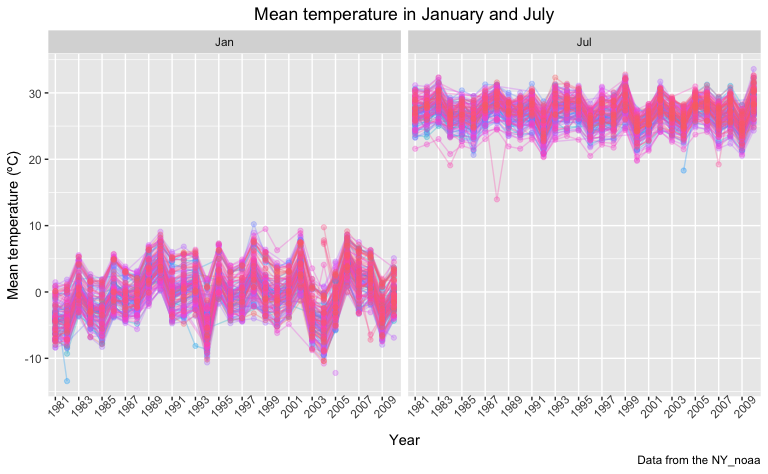

P8105 Homework 3
================
Zanis Fang, UID: ZF2213
10/4/2018

Problem 1
---------

### Data loading

``` r
# loading data
brfss <- p8105.datasets::brfss_smart2010 %>%
         # overall health topic
         filter(Topic == "Overall Health") %>% 
         # select necessary columns
         select(Year, Locationdesc, Response, Data_value) %>% 
         # seperate location into state and area
         separate(Locationdesc, c("state", "area"), sep = " - ") %>% 
         # recode response into factor variable
         mutate(Response = forcats::fct_relevel(Response,
                                                c("Excellent",
                                                  "Very good",
                                                  "Good",
                                                  "Fair",
                                                  "Poor"))) %>%
         # clean column names
         janitor::clean_names() %>% 
         # arrange dataset according to response from excellent to poor
         arrange(response)
```

**Q1. In 2002, which states were observed at 7 locations?**

``` r
# get year 2002
brfss %>% filter(year == 2002) %>%
          # get unique area
          distinct(state, area) %>%
          # group by states
          group_by(state) %>%
          # number of observations for each state
          summarize(locations = n()) %>%
          # get states which observed at 7 locations
          filter(locations == 7) %>%
          # output table
          knitr::kable(caption = "States Observed", longtable = TRUE)
```

| state |  locations|
|:------|----------:|
| CT    |          7|
| FL    |          7|
| NC    |          7|

Connecticut, Florida, North Carolina are observed at 7 locations.

**Q2. Make a “spaghetti plot” that shows the number of observations in each state from 2002 to 2010.**

``` r
# get distinct locations for each year each state
brfss %>% distinct(year, state, area) %>%
          # group according to year and state
          group_by(year, state) %>% 
          # count the number of observations for each year each state
          summarize(n_obs = n()) %>%
          # plot the spaghetti plot
          ggplot(aes(x = year, y = n_obs, color = state)) +
          geom_line() +
          geom_text(aes(label = ifelse(n_obs > 15, state, "")), show.legend = FALSE) +
          labs(
           title = "Unique locations across years for each state",
           x = "Years",
           y = "Number of Locations",
           caption = "Data from the brfss_smart2010"
          ) +
          viridis::scale_color_viridis(
           name = "state",
           discrete = TRUE
          ) +
          scale_x_continuous(breaks = c(2002:2010)) +
          theme(legend.position = "right", plot.title = element_text(hjust = 0.5))
```


Florida sharply increased the number of observations of more than 40 locations in year 2007 and 2010, and remained low during other years. New Jersey was on average the mostly observed state, around 20 observations each year started from 2005.

**Q3. Make a table showing, for the years 2002, 2006, and 2010, the mean and standard deviation of the proportion of “Excellent” responses across locations in NY State.**

``` r
# filter out year 2002, 2006, 2010 in NY state with response "Excellent"
brfss %>% filter(year %in% c(2002, 2006, 2010), response == "Excellent", state == "NY") %>% 
          # group according to area
          group_by(area) %>% 
          # get mean and sd across three years
          summarize(mean = mean(data_value), sd = sd(data_value)) %>% 
          # make a readable table
          knitr::kable(digits = 2, caption = "Excellent proportions")
```

| area               |   mean|    sd|
|:-------------------|------:|-----:|
| Bronx County       |  17.60|    NA|
| Erie County        |  17.20|    NA|
| Kings County       |  20.37|  1.77|
| Monroe County      |  22.40|    NA|
| Nassau County      |  24.93|  2.82|
| New York County    |  27.50|  1.54|
| Queens County      |  19.63|  1.36|
| Suffolk County     |  24.10|  3.28|
| Westchester County |  26.45|  0.64|

Since in Bronx, Erie and Monroe, there were only one observation out of three years, so sd are NAs. On average the New York County has most people responded excellent and least people responded excellent in Erie County.

**Q4. For each year and state, compute the average proportion in each response category (taking the average across locations in a state). Make a five-panel plot that shows, for each response category separately, the distribution of these state-level averages over time.**

``` r
# grouping
brfss %>% group_by(year, state, response) %>% 
          # get mean for each combination
          summarize(mean = mean(data_value)) %>% 
          # plot multiple spaghetti plots
          ggplot(aes(x = year, y = mean, color = state)) + 
            geom_line() +
            # multi panels
            facet_grid(. ~ response) +
            labs(
              title = "Mean for each state, year across locations",
              x = "Years",
              y = "Mean of proportions",
              caption = "Data from the brfss_smart2010"
            ) +
          # make title in the middle
          theme(plot.title = element_text(hjust = 0.5),
                # make x tick 45 angle
                axis.text.x = element_text(angle = 45)
                )
```

    ## Warning: Removed 1 rows containing missing values (geom_path).


The proportions of overall responses from high to low is "very good", "good", "excellent", "fair", "poor". It is worthy noting that he proportions of "excellent" are very slightly decreasing along the years. For each response there are some outliers in some states during some years.

Problem 2
---------

### Data loading

``` r
# load data
instacart <- p8105.datasets::instacart
```

This dataset has 1384617 entries with 15 variables. All the entries are the order information from registered customers. Each row describes an item ordered by a customer. There are columns describe the product name, department, aisle, and corresponding IDs of the item. There are also order information including the customer ID, order ID, nth order from the customer, if it is reordered from that customer, days since last order (frequency of order), time of the order in a week, time of the order in a day. eval\_set indicating whether this dataset is a training set or validation set. It seems that this set is a training set.

For instance the ID: 36 order, it was placed by customer ID: 79431, at 18:00 pm on Saturday, and it was the 23th reorder from that customer, 30 days since his/her last order. The customer ordered 8 items, among which 6 were reordered from that customer. Of the eight items, 3 from egg/dairy department, 3 from produce department. There are more detailed information such as aisle, product name and product id, etc.

**Q1. How many aisles are there, and which aisles are the most items ordered from?**

``` r
# list how many distinct aisles
instacart %>% 
 count(aisle) %>%
 nrow()
```

    ## [1] 134

``` r
# get which aisles are ordered most from
instacart %>%
 # group by aisle
 group_by(aisle) %>%
 # number of entries for each aisle
 summarize(n_order = n()) %>%
 # sort from high to low
 arrange(desc(n_order)) %>% 
 # top 10 aisles
 top_n(10) %>% 
 # output into table
 knitr::kable(caption = "Top 10 Aisles", digits = 2)
```

    ## Selecting by n_order

| aisle                         |  n\_order|
|:------------------------------|---------:|
| fresh vegetables              |    150609|
| fresh fruits                  |    150473|
| packaged vegetables fruits    |     78493|
| yogurt                        |     55240|
| packaged cheese               |     41699|
| water seltzer sparkling water |     36617|
| milk                          |     32644|
| chips pretzels                |     31269|
| soy lactosefree               |     26240|
| bread                         |     23635|

There are 134 aisles. Fresh vegetables and fresh fruits aisles are ordered the most. All the top 10 aisles are food.

**Q2. Make a plot that shows the number of items ordered in each aisle. Order aisles sensibly, and organize your plot so others can read it.**

``` r
instacart %>%
 # group by aisle
 group_by(aisle) %>%
 # number of orders for each aisle
 summarize(n_order = n()) %>%
 # sort according to number of orders
 mutate(rank = rank(n_order)) %>% 
 # plot scatterplot
 ggplot(aes(x = reorder(aisle, rank), y = log(n_order))) +
   # plot points
   geom_bar(stat = "identity", aes(fill = log(n_order)), show.legend = FALSE) +
   # flip coordinates
   coord_flip() +
   # add labels and titles
   labs(
    title = "Number of orders for each aisle",
    y = "Log transformed order numbers",
    x = "Aisles",
    caption = "Data from the instacart"
    ) +
   # make title in the middle
   theme(plot.title = element_text(hjust = 0.5))
```



Vegetables, fruits, sparkling water, yogurt, cheese, milk, chips, pretzels, bread, soy are ordered most. Personal care, baby goods, beauty, kitchen supplies are among the least ordered items. People order through instacart mainly for food, not for baby, beauty, or personal care.

**Q3. Make a table showing the most popular item aisles “baking ingredients”, “dog food care”, and “packaged vegetables fruits”**

``` r
instacart %>%
 # get the three aisle
 filter(aisle %in% c("baking ingredients",
                     "dog food care",
                     "packaged vegetables fruits")) %>%
 # group according to aisle and products
 group_by(aisle, product_name) %>%
 # number of orders for each item
 summarize(number_orders = n()) %>%
 # group by aisle
 group_by(aisle) %>%
 # get items with largest order number in each aisle
 filter(number_orders == max(number_orders)) %>%
 # output table
 knitr::kable(caption = "Most Popular Item Aisles")
```

| aisle                      | product\_name                                 |  number\_orders|
|:---------------------------|:----------------------------------------------|---------------:|
| baking ingredients         | Light Brown Sugar                             |             499|
| dog food care              | Snack Sticks Chicken & Rice Recipe Dog Treats |              30|
| packaged vegetables fruits | Organic Baby Spinach                          |            9784|

Light brown sugar, snack sticks chicken & rice recipe dog treats, organic baby spinach are most ordered items in the corresponding three aisle. Organic baby spinach greatly outnumbers the other two.

**Q4. Make a table showing the mean hour of the day at which Pink Lady Apples and Coffee Ice Cream are ordered on each day of the week; format this table for human readers (i.e. produce a 2 x 7 table).**

``` r
instacart %>%
 # get the products
 filter(product_name %in% c("Pink Lady Apples", "Coffee Ice Cream")) %>%
 # group by day of week and product name
 group_by(product_name, order_dow) %>%
 # get mean hours for each group
 summarize(mean_hour = mean(order_hour_of_day)) %>%
 # change number to weekdays
 mutate(order_dow = recode_factor(order_dow, "1" = "mon", "2" = "tue", "3" = "wed", "4" = "thr", "5" = "fri", "6" = "sat", "0" = "sun")) %>%
 # make human readable table
 spread(key = order_dow, value = mean_hour) %>%
 # output table
 knitr::kable(digits = 2, caption = "Mean hour of the day placing the order")
```

| product\_name    |    mon|    tue|    wed|    thr|    fri|    sat|    sun|
|:-----------------|------:|------:|------:|------:|------:|------:|------:|
| Coffee Ice Cream |  14.32|  15.38|  15.32|  15.22|  12.26|  13.83|  13.77|
| Pink Lady Apples |  11.36|  11.70|  14.25|  11.55|  12.78|  11.94|  13.44|

People buy ice cream late from Monday to Thursday, early during weekends and Friday. People buy apples around 2:00 pm in Wednesday and Sunday, but around noon for the rests.

Problem 3
---------

### Data loading

``` r
# load data
ny_noaa <- p8105.datasets::ny_noaa

# get na number and proportions
cbind(
 "na" = sapply(ny_noaa, FUN = function(x) {sum(is.na(x))}),
 "proportion" = sapply(ny_noaa, FUN = function(x) {sum(is.na(x)) / length(x)})
) %>% knitr::kable(caption = "Missing Values", digits = 3)
```

|      |       na|  proportion|
|------|--------:|-----------:|
| id   |        0|       0.000|
| date |        0|       0.000|
| prcp |   145838|       0.056|
| snow |   381221|       0.147|
| snwd |   591786|       0.228|
| tmax |  1134358|       0.437|
| tmin |  1134420|       0.437|

The dataset has 2595176 entries. 747 unique stations. There are 9 variables, station id (character), date of observation (date), precipitation (in 0.1 mm, integer), snowfall (in mm, integer), snow depth (in mm, integer), max temperature (in 0.1 ºC, integer), min temperature (0.1 ºC, integer).

Many stations only collect a subset of these data for some time. There are around 0.145 million (5.62%) entries without precipitation data, 0.38 million (14.69%) entries without snowfall observations, 0.59 million (22.80%) entries without snow depth information, 1.134 million (43.7%) without temperature data.

**Q1. For snowfall, what are the most commonly observed values? Why?**

``` r
ny_noaa <- ny_noaa %>% 
 # seperate data into year month day 
 separate(col = date, into = c("year", "month", "day"), sep = "-") %>%
 # change tmax and tmin to ºC degree, precipitation in mm
 mutate(tmax = as.integer(tmax) / 10, tmin = as.integer(tmin) / 10, prcp = prcp / 10,
        # get rid of negative snow and snwd value
        snow = replace(snow, which(snow < 0), NA))

ny_noaa %>% 
 filter(!is.na(tmin), !is.na(snow)) %>% 
 mutate(tmin_0 = tmin > 0) %>% 
 group_by(tmin_0) %>% 
 count(snow == 0) %>% 
 knitr::kable()
```

| tmin\_0 | snow == 0 |       n|
|:--------|:----------|-------:|
| FALSE   | FALSE     |  117822|
| FALSE   | TRUE      |  378116|
| TRUE    | FALSE     |    1734|
| TRUE    | TRUE      |  790374|

Divide tmin, tmax, prcp by 10 to be in ºC and mm units. There is a snow value less than 0, which is not reasonable, so I change it to NA. For snowfall variable, most of them are zero because when minimal temperature is larger than 0 ºC, very little snow can form.

**Q2. Make a two-panel plot showing the average temperature in January and in July in each station across years. Is there any observable / interpretable structure? Any outliers?**

``` r
# get January and July
ny_noaa %>% filter(month %in% c("01", "07")) %>%
 # group according to year and month
 group_by(year, month) %>%
 # get mean for each group
 summarize(mean_temp = mean(tmax, na.rm = TRUE)) %>%
 # recode the month name
 mutate(month = recode(month, "01" = "Jan", "07" = "Jul")) %>%
 # plot multi facets plot
 ggplot(aes(y = mean_temp, x = year)) +
   geom_point() +
   # seperate by month
   facet_grid(. ~ month) +
   scale_x_discrete(breaks = seq(1981,2010,2)) +
   labs(
      title = "Mean temperature in January and July",
      y = "Mean temperature (ºC)",
      x = "Year",
      caption = "Data from the NY_noaa"
    ) +
   # make title in the middle
   theme(plot.title = element_text(hjust = 0.5),
         axis.text.x = element_text(angle = 45))
```



Max temperatures are high in July , around 27.5 ºC, and low in Janurary, around 0 ºC, which are quite reasonable. There is no obvious outlier.

**Q3. Make a two-panel plot showing (i) tmax vs tmin for the full dataset (note that a scatterplot may not be the best option); and (ii) make a plot showing the distribution of snowfall values greater than 0 and less than 100 separately by year.**

``` r
# 2d density plot to show tmax ~ tmin relation
tmax_tmin <- ny_noaa %>%
             ggplot(aes(x = tmax, y = tmin)) +
               # using two dimensional density plot
               geom_density_2d() +
               labs(
                 title = "Max vs Min Temperature",
                 y = "Min temperature (ºC)",
                 x = "Max temperature (ºC)",
                 caption = "Data from the ny_noaa"
                )

# boxplot to show distribution across years
snf <- ny_noaa %>%
       # get snowfall larger than 0 and smaller than 100
       filter(snow > 0, snow < 100) %>%
       # violin plot
       ggplot(aes(x = year, y = snow)) +
         geom_violin() +
         labs(
          title = "Distribution of Snowfall Each Year",
          x = "Year",
          y = "Snowfall (mm)",
          caption = "Data from ny_noaa"
         ) +
         theme(axis.text.x = element_text(angle = 30))

library(patchwork)
tmax_tmin / snf
```

    ## Warning: Removed 1136276 rows containing non-finite values
    ## (stat_density2d).


The tmax vs tmin density plot shows obviously two clusters, one around (5, 0) and another around (25, 15). The first one may refer to cold areas while the second one refer to warm areas. The distribution of snowfall for each year has equal median at 25 mm, the violin plot shows several "nodes" along the snow distribution.
